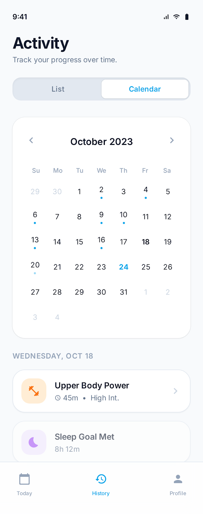
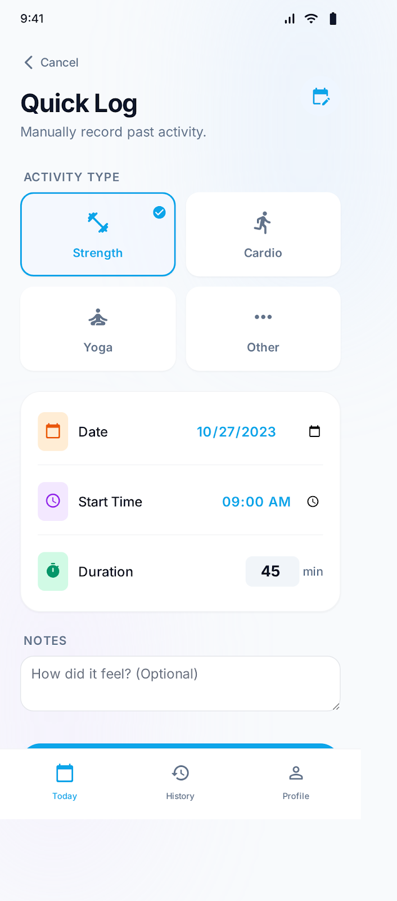

## Context

The app already supports quick logging and a list-based History screen, but it lacks a fast way to answer "what did I do last week?" and it can't represent future activities that should influence training decisions.

The product vision emphasizes radical simplicity, local-first behavior, and minimal logging friction.

## Goals / Non-Goals

Goals:
- Provide a month calendar view that can show completed sessions and planned events at a glance.
- Make logging/backfilling an activity possible in under ~10 seconds from the calendar.
- Support planning future events (e.g., hike on Saturday) that can inform daily generation as context.
- Keep the experience local-first; planned events should work offline.

Non-Goals:
- Full external calendar sync (Google/Apple) in the first iteration.
- Complex recurrence rules (RRULE), multi-day events, or reminders/notifications.
- Detailed analytics dashboards (volume, PRs, etc.).
- Programmatic conflict detection or UI warnings (the LLM considers events as context, but the app doesn't try to detect/warn about conflicts itself).

## Decisions

- **Contract philosophy: strict core + extensible metadata**
  - Keep a small set of required, stable fields for any planned event so the calendar UI and generation can rely on them.
  - Add explicit extension points (`metadata`, `details`) so we can grow event capabilities without breaking older clients or forcing new server fields.
  - Prefer *layered* contracts: local storage can be richer than what is sent to generation.

- **Data model (local-first):** introduce a `PlannedEvent` entity stored on-device.
  - Planned events are separate from `WorkoutSession` to avoid overloading session semantics (completed vs scheduled).

- **Planned workouts vs life events:** both use the same `PlannedEvent` entity, distinguished by `kind`:
  - `kind: 'workout'` = app-owned planned workout (can link to generated session, offers generation action)
  - `kind: 'hike' | 'travel' | ...` = external life event (visible constraint, no workout-specific actions)

- **Timezone handling:** store `localDate` as the user's intended calendar day plus `createdAtTimezone` for future re-interpretation. Don't try to be clever with UTC conversion in v1.

### Proposed shared contracts (draft)

These are intended to live in `@leveza/shared` as Zod schemas + types.

#### Canonical Event Kinds

```ts
// Canonical kinds - UI provides icons/labels for these
const CANONICAL_EVENT_KINDS = ['workout', 'hike', 'run', 'sport', 'rest', 'travel', 'other'] as const;
type CanonicalEventKind = typeof CANONICAL_EVENT_KINDS[number];

// The kind field accepts any string for flexibility; unknown kinds render as "other"
```

#### PlannedEvent (local storage contract)

- `kind` is intentionally an opaque string (not a closed enum) for maximum flexibility; the UI maps unknown kinds to "other".
- `localDate` is stored explicitly (`YYYY-MM-DD`) to make calendar bucketing stable even if device timezone changes later.
- `createdAtTimezone` preserves context for future migration if needed.
- `metadata` and `details` exist specifically to avoid "schema churn".

**WatermelonDB patterns (matching existing entities like Workout):**
- IDs are UUIDv7, auto-generated via the global `setGenerator(() => uuidv7())` config
- Timestamps are Unix milliseconds (numbers), not ISO strings
- Use `archivedAt` pattern for soft delete (consistent with Workout model)
- Complex nested data stored as JSON strings (`detailsJson`, `metadataJson`)
- No entity-level `schemaVersion` - versioning is at the database schema level

```ts
// Shared types (for contracts and UI)
type LocalDate = string; // YYYY-MM-DD
type Timezone = string; // IANA timezone, e.g., "America/Los_Angeles"

// WatermelonDB Model (local storage)
// Note: id, createdAt, updatedAt are managed by WatermelonDB
type PlannedEventRecord = {
  id: string; // UUIDv7, auto-generated

  kind: string; // Prefer canonical kinds; unknown kinds render as "other"
  title: string;

  localDate: LocalDate;
  createdAtTimezone: Timezone; // Timezone when event was created

  startsAt?: number; // Unix timestamp, optional for all-day items
  endsAt?: number;
  allDay?: boolean;
  durationMinutes?: number;

  intensity?: 'low' | 'moderate' | 'high';
  tagsJson?: string; // JSON array of strings
  notes?: string;

  status?: 'planned' | 'canceled';
  linkedWorkoutId?: string; // FK to workouts table for kind='workout'

  // Extension points (stored as JSON strings)
  detailsJson?: string; // kind-specific structured details
  metadataJson?: string; // forward-compatible flags/fields

  // Timestamps (managed by WatermelonDB)
  createdAt: number; // Unix timestamp
  updatedAt: number; // Unix timestamp
  archivedAt?: number; // Soft delete for future sync
};
```

#### PlannedEventInput / PlannedEventPatch (write contracts)

This separates "what you can set" from "what is system-managed".

```ts
type PlannedEventInput = {
  kind: string;
  title: string;
  localDate: LocalDate;
  createdAtTimezone: Timezone;
  startsAt?: number;
  endsAt?: number;
  allDay?: boolean;
  durationMinutes?: number;
  intensity?: 'low' | 'moderate' | 'high';
  tags?: string[];
  notes?: string;
  status?: 'planned' | 'canceled';
  linkedWorkoutId?: string;
  details?: Record<string, unknown>;
  metadata?: Record<string, unknown>;
};

type PlannedEventPatch = Partial<PlannedEventInput> & { id: string };
```

Note: `tags`, `details`, and `metadata` are provided as native types in the input contract; the repository serializes them to JSON strings for storage.

#### CalendarItem (UI aggregation contract)

The calendar merges existing completed sessions and planned events. This contract includes display-ready fields so the UI can render day cells and agenda items without re-fetching full records.

```ts
type CalendarItem =
  | {
      type: 'workout-session';
      localDate: LocalDate;
      sessionId: string;
      title: string; // e.g., "Upper Body" or workout name
      completedAt?: IsoDateTime;
      durationMinutes?: number;
    }
  | {
      type: 'planned-event';
      localDate: LocalDate;
      eventId: string;
      kind: string; // For icon selection
      title: string;
      startsAt?: IsoDateTime;
      allDay?: boolean;
    };
```

#### UpcomingEventContext (generation boundary contract)

The generation endpoint does not need the full local event record—only a bounded, prompt-friendly summary. This is passed as optional context; the LLM may consider it but we don't programmatically enforce conflict avoidance.

```ts
type UpcomingEventContext = {
  kind: string;
  title: string;
  startsAt?: IsoDateTime;
  localDate: LocalDate;
  durationMinutes?: number;
  allDay?: boolean;
  intensity?: 'low' | 'moderate' | 'high';
  tags?: string[];
  notes?: string;
  metadata?: Record<string, unknown>;
};
```

- **Calendar composition:** the calendar UI is a merge of:
  - completed `WorkoutSession` records (existing), and
  - `PlannedEvent` records (new).
- **Generation integration:** when generating a workout, the client MAY send a bounded `upcomingEvents[]` summary (e.g., next 7 days, max 10) as part of the generation request.
  - The server uses this as prompt/context input but does not need to persist it.
  - No programmatic conflict detection; the LLM considers events as context only.

## Alternatives Considered

- **Server-persisted events + sync:** richer long-term, but introduces auth/sync complexity and undermines offline-first iteration speed.
- **Represent planned events as `WorkoutSession` with `status=planned`:** would reduce entities, but mixes "did" vs "will do" and complicates existing history and generation context behavior.
- **Separate `PlannedWorkout` entity:** considered for planned workouts vs life events, but adds complexity. Using `kind: 'workout'` within a single entity is simpler for v1.

## Risks / Trade-offs

- **Timezone boundaries:** date bucketing must be done consistently (device timezone) to avoid events appearing on adjacent days. Storing `createdAtTimezone` provides an escape hatch.
- **LLM compliance:** generation may not always respect upcoming event context; this is acceptable for v1 since we're not promising conflict avoidance.
- **UI complexity creep:** calendar interactions can expand quickly; keep flows tight (month → day agenda → quick actions).

## Migration Plan

- Add a new local table for planned events; no changes needed for existing workout session rows.
- Introduce schema/versioning for planned event records so future sync can be added without breaking local data.

## Open Questions

- Should the History tab be renamed to Calendar, or should Calendar be a toggle within History?

## Design Mocks

### Calendar View



The calendar view within the History tab shows:
- **List/Calendar toggle** - Switch between existing list view and new calendar view
- **Month calendar** - Navigation arrows, day grid with activity indicator dots (cyan)
- **Today highlight** - Current day shown in cyan (24th)
- **Day agenda** - Tapping a day shows activities for that date below the calendar
- **Activity cards** - Show title, duration, intensity, and kind-specific icons

### Quick Log Flow



The quick log bottom sheet allows fast activity logging:
- **Activity type grid** - Strength, Cardio, Yoga, Other (maps to `kind` field)
- **Date picker** - Defaults to selected calendar date
- **Start time picker** - Optional time selection
- **Duration picker** - Minutes input
- **Notes field** - Optional free-text notes
